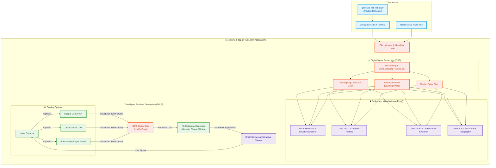

# 🧠 FEBUS DTSS Viewer & Assistant

An interactive, high-performance Streamlit dashboard and AI-powered assistant designed to explore, visualize, and query Distributed Temperature and Strain Sensing (DTSS) data stored in HDF5 format.

## 📊 Project Block Diagram

The diagram below outlines the data flow, digital signal processing (DSP) pipeline, layout presentation, and AI Assistant subsystem:



---

## 🚀 Key Features

*   **📊 Multi-Dimensional Visualization**:
    *   **2D Spatial Analysis**: Slice temperature and strain profiles across the fiber length for specific measurement times.
    *   **2D Time-Series Evolution**: Track temperature and strain changes at any individual fiber location over the entire monitoring period.
    *   **3D Surface Topography**: Generate topographic interactive plots displaying space-time thermal and mechanical dynamics.
*   **〰️ Advanced Digital Signal Processing (DSP)**:
    *   **Smoothing**: Moving Average and Savitzky-Golay filtering.
    *   **Frequency Filters**: Butterworth low-pass and high-pass filters to reduce high-frequency noise or capture trends.
    *   **Spike Removal**: Median filtering for sensor spike mitigation.
*   **🧠 Intelligent AI Assistant**:
    *   Natural language query extractor (parses questions like *"What is the peak temperature in scan 3?"* or *"Hottest spot in the cable history?"*).
    *   Support for multiple LLM backends: **Google Gemini**, local **Ollama** models, and a fast regex-based **Rules Engine** fallback.
    *   Side-by-side interactive data panel for manual cross-verification.
*   **⚙️ Physics-Based Fiber Simulator**:
    *   Generates custom synthetic FEBUS DTSS HDF5 datasets.
    *   Simulates realistic temperature/strain events (sinusoidal, linear, transient peaks).
    *   Computes Brillouin Frequency Shifts (BSL) based on official physical sensitivities.
*   **⚡ Performance Optimization**:
    *   Automatic signal downsampling for high-resolution datasets (>1500 spatial points) to maintain fluid rendering rates in Plotly.
    *   Optimized low-overhead HDF5 file-reading utilities.

---

## 📁 Project Structure

Below is an overview of the codebase organization:

*   **[`combined_app.py`](file:///c:/Users/fabio.bassan/Desktop/frbassan_git/bot_febus/combined_app.py)**: The unified application file containing the Streamlit UI, DSP pipelines, layout tabs, Plotly configurations, and AI Assistant integration.
*   **[`generate_tsb_febus.py`](file:///c:/Users/fabio.bassan/Desktop/frbassan_git/bot_febus/generate_tsb_febus.py)**: Physics-based data generator to create synthetic HDF5 datasets simulating fiber events, noise, and BSL calculations.
*   **[`test_perf.py`](file:///c:/Users/fabio.bassan/Desktop/frbassan_git/bot_febus/test_perf.py)**: A lightweight script to benchmark global metadata reading and spatial profile extraction performance.
*   **[`requirements.txt`](file:///c:/Users/fabio.bassan/Desktop/frbassan_git/bot_febus/requirements.txt)**: Python package dependencies (Streamlit, H5py, NumPy, Pandas, etc.).
*   **Legacy / Build Scripts**:
    *   `app.py` & `h5_viewer.py`: Original separate codebases for the AI assistant and HDF5 viewer.
    *   `merge_script.py`: Script used to merge `app.py` and `h5_viewer.py` into the unified app.
    *   `add_time_series.py`: Utility that appended time-series tabs (tabs 4 and 5) to `combined_app.py`.
    *   `apply_plotly.py`: Programmatic migration from Matplotlib to interactive Plotly graphs.
    *   `adjust_labels.py` & `adjust_dark.py`: Layout polishing scripts that customized the visual design, gridlines, axis naming, and dark/light templates.
    *   `fix_datetime.py`: Script resolving date parsing inconsistencies in the application.

---

## 🗄️ HDF5 Data Structure

The application expects HDF5 files (`.h5` or `.hdf5`) configured with the following structure, aligned with official FEBUS DTSS interrogator outputs:

### Root Attributes (Metadata)
| Attribute | Type | Description |
|---|---|---|
| `acq_res` | `int` | Acquisition resolution settings |
| `average` | `int` | Number of averaged sweeps |
| `fiberLength` | `int` | Total physical length of the fiber (m) |
| `sampling_resolution`| `float` | Distance step between sampling channels (m) |
| `temp_freq_sensitivity` | `float` | Fiber frequency sensitivity to Temperature (~1.07 MHz/°C) |
| `strain_freq_sensitivity`| `float` | Fiber frequency sensitivity to Strain (~0.046 MHz/µε) |
| `start_time` / `end_time` | `float` | Timestamps indicating monitoring period limits |

### Datasets
*   **`distances`** `[N_distances]`: 1D array mapping each sampling point to its physical distance along the fiber (in meters).
*   **`start_times`** `[N_traces]`: 1D array containing unix timestamps for when each trace measurement began.
*   **`end_times`** `[N_traces]`: 1D array containing unix timestamps for when each trace measurement finished.
*   **`temp_data`** `[N_traces x N_distances]`: 2D array of temperature readings (°C).
*   **`strain_data`** `[N_traces x N_distances]`: 2D array of strain/deformation readings (microstrain, µε).
*   **`bsl_data`** `[N_traces x N_distances]`: 2D array of raw Brillouin Shift frequencies (MHz).

---

## ⚙️ How it Works: DSP Filtering & Physical Simulation

### Digital Signal Processing (DSP)
The app includes interactive scipy-based filtering tabs for 2D profile graphs:
1.  **Moving Average**: Smooths local spatial fluctuations using a rolling mean window.
2.  **Savitzky-Golay**: Applies a local polynomial regression to preserve signal peaks while filtering high-frequency noise.
3.  **Butterworth Filter**: Performs zero-phase digital filtering (`filtfilt`) with customizable low-pass or high-pass frequency thresholds.
4.  **Median Filter**: Replaces samples with their neighborhood median to reject short-lived sensor spikes.

### Synthetic Data Generation
[`generate_tsb_febus.py`](file:///c:/Users/fabio.bassan/Desktop/frbassan_git/bot_febus/generate_tsb_febus.py) creates physical events on the fiber using a Gaussian kernel:
$$\text{Event}(x) = A \cdot f(t) \cdot \exp\left(-0.5 \cdot \left(\frac{x - x_{\text{center}}}{\sigma}\right)^2\right)$$
where $A$ is the amplitude, $f(t)$ represents the temporal evolution factor (sinusoidal, linear, or peak), and $\sigma$ represents the event width. 
It then calculates the corresponding Brillouin Frequency Shift:
$$\text{BSL}(x, t) = \text{BSL}_{\text{ref}} + (T(x,t) - T_{\text{ref}}) \cdot C_T + (\epsilon(x,t) - \epsilon_{\text{ref}}) \cdot C_\epsilon$$
where $C_T$ and $C_\epsilon$ are the temperature and strain frequency sensitivities, respectively.

---

## 🛠️ Setup & Running

### 1. Installation
Ensure you have Python 3.9+ installed. Clone the repository and install the dependencies listed in `requirements.txt`. You will also need `scipy` for digital filters:

```bash
pip install -r requirements.txt scipy
```

### 2. Generate Simulated Data (Optional)
If you do not have a real FEBUS HDF5 file, run the physics simulator to build a 2km synthetic dataset:

```bash
python generate_tsb_febus.py
```
This generates `Simulated_FiberTest_TSB_2km_0.1m_res_noise_1_5.h5`.

### 3. Run the Dashboard
Launch the unified Streamlit application:

```bash
streamlit run combined_app.py
```

Open `http://localhost:8501` in your browser.

---

## 🤖 AI Assistant Configuration
Under the **Intelligent Assistant** tab, configure the desired backend in the sidebar:
1.  **Rules (Local/Fast)**: Regular expression parsing. Fast and requires no API keys or servers.
2.  **Google Gemini**: Highly capable generative AI parsing. Requires a `GEMINI_API_KEY` (configured via sidebar or a `.env` file).
3.  **Ollama (Local)**: Queries a locally run Ollama model (e.g. `llama3` or `mistral`) at `http://localhost:11434`.
